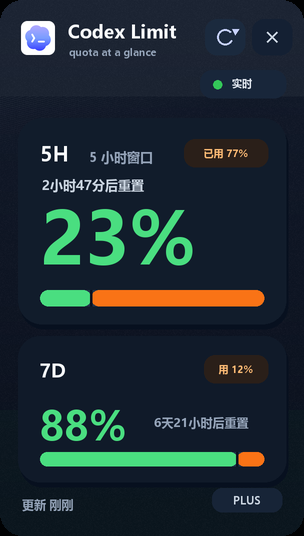

# Codex Usage Widget

An unofficial desktop widget for checking your local Codex usage limits at a glance.

It shows the two limit windows people care about most:

- `5H`: short-window remaining quota
- `7D`: weekly remaining quota

The interface is designed as a compact Windows desktop widget with a dark acrylic/glass look, rounded corners, high-DPI rendering, hover translucency, and color-coded usage bars.



## Highlights

- Real local Codex limit snapshots, not mocked counters
- 5-hour and 7-day quota windows
- Green remaining segment and orange used segment
- Hover glass mode: move the mouse over the widget to make it translucent enough to see content underneath
- Manual refresh, auto refresh, always-on-top mode, and drag-to-position
- Cache fallback when Codex has not written a fresh snapshot yet
- Windows startup install/uninstall scripts
- macOS launcher included for sharing with teammates
- Built-in tests for parsing, caching, stale windows, and UI rendering

## Privacy

This widget only reads local Codex files under your own `~/.codex` directory.

It does not upload data, does not call a server, and does not read or display your conversation content. The UI only uses local rate-limit snapshots such as remaining percentage, used percentage, reset time, and plan label.

## Windows Quick Start

1. Install Python 3.10+ if you do not already have it.
2. Install Pillow:

   ```powershell
   py -m pip install pillow
   ```

3. Double-click `start.cmd`.

Optional:

- Double-click `install-startup.cmd` to launch it automatically when Windows starts.
- Double-click `uninstall-startup.cmd` to remove startup launch.
- Right-click the widget for refresh, always-on-top, reset position, and quit.

## macOS Quick Start

1. Install Python 3 if needed.
2. Double-click `start-mac.command`.
3. If macOS blocks it, right-click the file and choose Open.

The first launch creates a local `.venv` and installs Pillow automatically.

## Run Tests

Windows:

```powershell
run-tests.cmd
```

Cross-platform:

```bash
python codex_usage_widget.py --test --include-ui
```

## Data Sources

The widget reads local Codex runtime files, including:

- `~/.codex/logs_2.sqlite`
- `~/.codex/sessions/**/*.jsonl`

Successful snapshots are cached locally so the widget can keep showing the last known value if Codex has not emitted a new limit event yet.

Cache locations:

- Windows: `%APPDATA%\CodexUsageWidget\limit_sample.json`
- macOS: `~/Library/Application Support/CodexUsageWidget/limit_sample.json`

## Design Notes

The UI is intentionally narrow and vertical so it can live near the edge of the screen. It uses a restrained dark glass surface, large remaining-percentage typography, and a split quota bar:

- Left side: remaining quota
- Right side: used quota

On hover, the widget lowers window opacity and brightens the acrylic surface, making it possible to inspect whatever is behind it without fully hiding the quota information.

## Disclaimer

This is an unofficial community project and is not affiliated with OpenAI.

Codex and OpenAI are trademarks of their respective owners.
